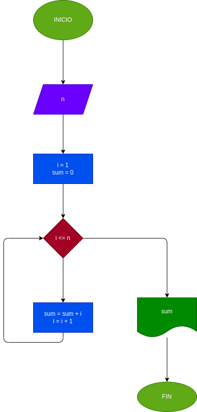

# instrucciones repetitivas
Ejercicio 1

Hallar la suma de los n primeros numeros enteros positivos

## Análisis
Se busca sumar los n primeros números en una secuencia por ejemplo, sumar los 10 primeros numeros enteros: 

1 + 2 = 3; 3 + 3 = 6; 6 + 4 = 10; 10 + 5 = 15; 15 + 6 = 21; 21 + 7 = 28; 28 + 8 = 36; 36 + 9 = 45; 45 + 10 = 55

por ende; se utiliza While "mientras"; para poder repetir una condicion(almacena las variables y se le llama acumuladores) hasta que esta se vuelva falsa y me imprima el resultado. 

## Diagrama de flujo
